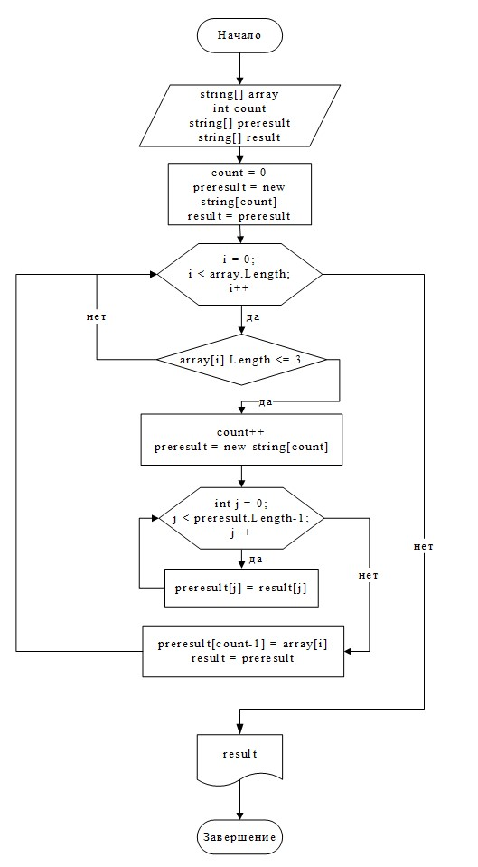
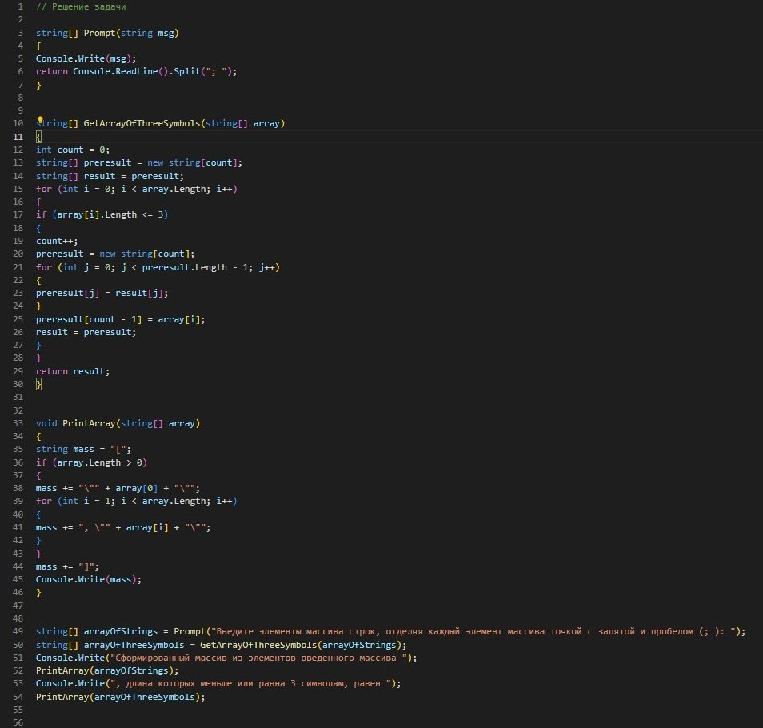

**Итоговая контрольная работа по основному блоку:**                                           
 Написать программу, которая из имеющегося массива строк формирует новый массив из строк, длина которых меньше, либо равна 3 символам. Первоначальный массив можно ввести с клавиатуры, либо задать на старте выполнения алгоритма. При решении не рекомендуется пользоваться коллекциями, лучше обойтись исключительно массивами.

**Необходимо:**                               
1. Создать репозиторий на Github           
2. Нарисовать блок-схему алгоритма          
3. Снабдить репозиторий оформленным текстовым описанием решения (файл README.md)                                       
4. Написать программу, решающую поставленную задачу                        
5. Использовать контроль версий в работе над этим небольшим проектом (не должно быть так, что всё залито одним коммитом, как минимум этапы 2, 3, и 4 должны быть расположены в разных коммитах)

**Блок-схема алгоритма решения**

**Решение задачи:**
1. *Первоначальный массив строк:*
Первоначальный массив задаем путем запроса ввода элементов массива строк, отделяя каждый элемент массива точкой с запятой и пробелом (; ). Для чего выделяем отдельно  Prompt(), который на вход принимает текст выводимый на экран пользователю, а в результате выдает массив строк, полученный с помощью string.Split("; ").
2. *Формирование из первоначального массива .строк нового массива строк, длина которых меньше либо равна 3 символам:*
Получение из первоначального массива строк нового массива из строк, длина которых меньше либо равна 3 символам, выделяем отдельно в  GetArrayOfThreeSymbols(), который на вход получает первоначальный массив строк, а в результате выдает новый.

 **Алгоритм метода заключается в следующем:**
1.	Сначала задаем переменные: count - длина массива, первоначальное значение которого равно 0, result - результирующий массив строк, preresult - массив строк для сохранения значений элементов предыдущего (старого) результирующего массива строк result.
2.	Путем цикла for проходим по всем элементам входного массива array.
•	Внутри цикла проверяем длину строки каждого элемент массива array. При этом, если длина меньше либо равна 3 символам, то выполняем следующие действия, описанные ниже, а если условие не выполняется, то идем к следующему кругу внутри цикла for указанного в п.2.
•	Увеличиваем значение переменной count на 1 и создаем новый массив preresult с длиной равной count.
•	Путем нового цикла for копируем значения элементов массива строк result.
•	Последнему элементу нового массива строк preresult присваиваем значение элемента массива array.
•	Присваиваем result новый массив строк preresult.
•	Идем к следующему кругу внутри цикла for из п.2. И так до конца цикла.
3.	Возвращаем в качестве результата метода GetArrayOfThreeSymbols() массив строк result.

**Вывод на экран массива**

*Для вывода на экран массива строк выделяем отдельнщ PrintArray(), который:*
1.	На вход принимает массив строк array.
2.	Вводит строковую переменную mass, приравнивая к ней "[" - для визульного восприятия массива пользователем в виде квадратных скобок [].
3.	Проверяет длину массива строк array. Если условие выполняется, то выполняются действие ниже, а если нет - то переход в п.4.
•	Добавляет к значению переменной mass значение элемента массива array[0].
•	С помощью цикла for добавляются к значению переменной mass остальные значение элемента массива array, при их наличии.
4.	Добавляет к значению переменной mass закрывающую квадратную скобку "]".
5.	 Выводит на экран значение переменной mass.

**Программа**

